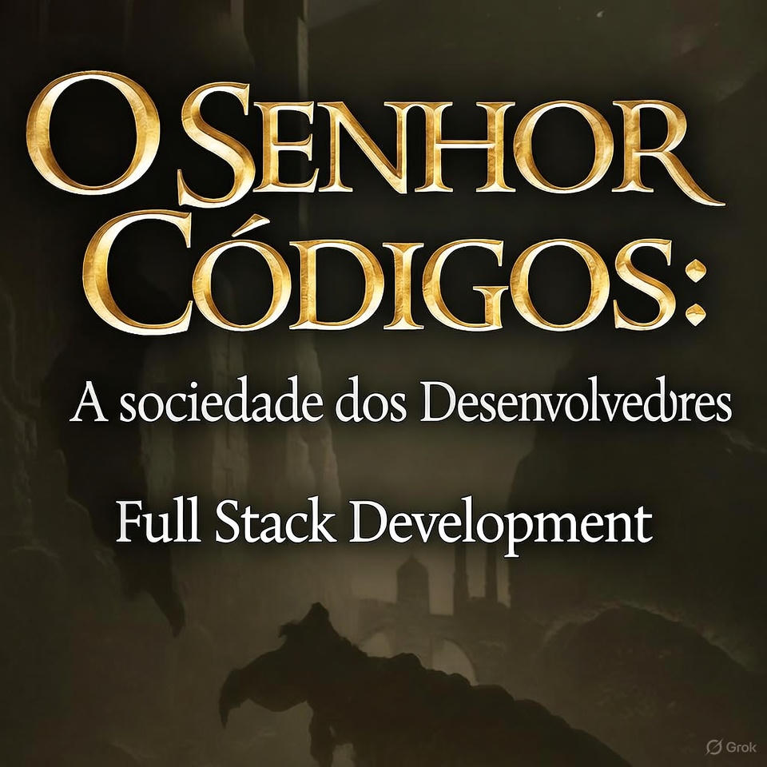

  

  

    <b>Preview do Podcast</b>

    <audio src="output/podcast_editado.MP3" controls title="Podcast editado"></audio>

# 🎙️ Projeto Podcast Gerado por I.A.s

> ℹ️ **NOTE:** Este é o repositório desenvolvido por **Ismael Santos de Medeiros**.

Projeto com o objetivo de gerar um podcast utilizando ferramentas de IA através de prompts mais trabalhado.

Utilizei uma esteira de prompts para gerar cada etapa do processo criativo.

---

## 💻 Tecnologias utilizadas no projeto

- 🤖 [ChatGPT](https://chat.openai.com/) — Gerenciamento e criação do roteiro
- 🎨 [MidJourney](https://www.midjourney.com/app/) — Geração das artes de capa
- 🗣️ [ElevenLabs](https://beta.elevenlabs.io/) — Clonagem e síntese de voz neural
- 🎬 [Capcut](https://www.capcut.com/pt-br/) — Edição, sonorização e tratamento de áudio

---

## ✨ Como foi feito?

- Roteiro gerado via ChatGPT
- Áudio gerado pela ElevenLabs
- Midjourney para gerar capas
- Capcut para tratar áudio e adicionar sons de fundo

---

## 📚 Materiais

- Prompts Nome do Podcast está localizado na pasta `src/prompts`
- Prompt para criação da Imagem de Capa está localizado na pasta `src/prompts`
- Capcut link: [Editor de áudio](https://www.capcut.com/editor?from_page=landing_page&__action_from=picture_V%C3%ADdeos%20profissionais%20em%20minutos,%20n%C3%A3o%20em%20horas.)

---

## 🛠️ Instruções de execução

Utilizei os prompts dentro da pasta "src/prompts", para replicar o resultado siga o passo a passo abaixo.

- 🤖 1. Use os prompts de roteiro no `chatgpt`
- 🤖 2. Use os prompts de roteiro gerados pelo chatgpt no `ElevenLabs`
- 🤖 3. Use os prompts da pasta output no `midjourney`

---

## 👨‍💻 Expert

    
    
&nbsp;&nbsp;&nbsp;<b>Ismael Medeiros</b> 
    &nbsp;&nbsp;&nbsp;
    <a 
        href="https://github.com/ism-dev-codes">
        GitHub
    </a>
    &nbsp;|&nbsp;
    <a 
        href="https://www.linkedin.com/in/ismael-medeiros">
        LinkedIn
    </a>
    &nbsp;|&nbsp;
    <a 
        href="https://www.instagram.com/ismaelsmedeiros?igsh=YXA1OW1mNXhkNmVy">
        Instagram
    </a>

  

